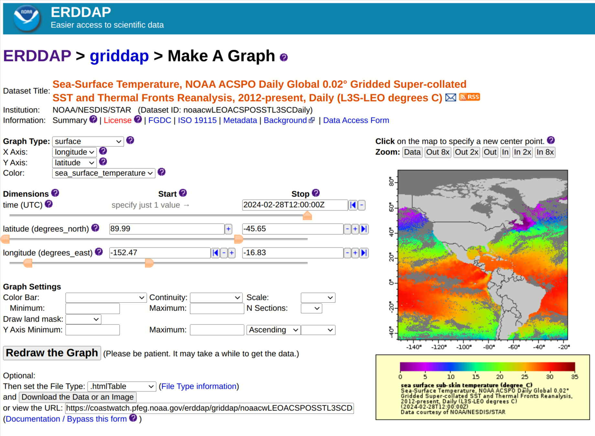

# ERDDAP&trade;: Easier Access to Scientific Data

**Welcome to the ERDDAP&trade; GitHub repository** 

ERDDAP&trade; is a scientific data server that gives users a simple, consistent way to download subsets of gridded and tabular scientific datasets in common file formats and make graphs and maps.  ERDDAP&trade; is a Free and Open Source (Apache and Apache-like) Java Servlet developed by the NOAA NMFS SWFSC Environmental Research Division (ERD).

A live ERDDAP&trade; installation can be seen at: https://coastwatch.pfeg.noaa.gov/erddap/index.html.

*Example screenshot of ERDDAP&trade;'s web user interface 'Make-a-Graph' page*

## Developing with ERDDAP&trade;

ERDDAP&trade; is a Java Servlet-based application and can be run in any compatible Java Servlet Container/Application Server, such as Apache Tomcat.

Local development and testing of ERDDAP&trade; code can be done without a production-scale installation.  Two approaches are recommended:

* **Jetty Servlet Container** - see: [ERDDAP&trade; Development with Maven and Jetty](./development/jetty/).
* **Docker/Tomcat** (building and running an ERDDAP&trade; development Docker image) - see: [ERDDAP&trade; Development with Docker/Tomcat](./development/docker/)

For operational ERDDAP&trade; deployment, [Apache Tomcat](https://tomcat.apache.org/) is recommended.  See [Deploying ERDDAP&trade; Operationally](#deploying-erddap-operationally) for instructions.

### Running JUnit tests

Simply run `mvn test` in a terminal to run the JUnit tests.

Note that by default tests that do an image comparison are enabled. To disable those tests add `ImageComparison` to the `excludedGroups` section of the surefire `configuration`. It is recommended you run the image tests before making changes to ERDDAP&trade; so you can generate a baseline set of images that will be later used for comparison.

### Metrics

Metrics are collected using [Prometheus](https://prometheus.github.io/client_java/). You can see the metrics on a local server at [/erddap/metrics](http://localhost:8080/erddap/metrics?debug=text).

### Building a war

`mvn package` will create a war file. 

If you'd like to skip the tests while building use `mvn package -DskipTests`. You can use the skipTests flags with other maven commands.

### Running the code formatter

To format code locally you can run:

(Windows)
`mvn git-code-format:format-code -D"gcf.globPattern=**/*"`

(Other)
`mvn git-code-format:format-code -Dgcf.globPattern=**/*`

Code should be automatically formatted during a git pre-commit step to simplify reviews. It can still be useful sometimes to format code before making a git commit.

## Contributing Code to ERDDAP&trade;

Below are relevant links for getting involved with the ERDDAP&trade; community and contributing to ERDDAP:

* Review conversations and ask questions at https://groups.google.com/g/erddap or at https://github.com/erddap/erddap/discussions
* Review and submit issues to https://github.com/erddap/erddap/issues
* To propose feature requests, follow this guidance: https://github.com/erddap/erddap/discussions/93

## Deploying ERDDAP&trade; Operationally

Instructions for installing ERDDAP&trade; in Apache Tomcat are available at: https://erddap.github.io/setup.html.
